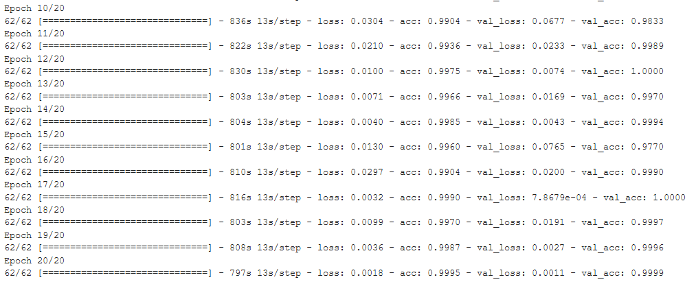
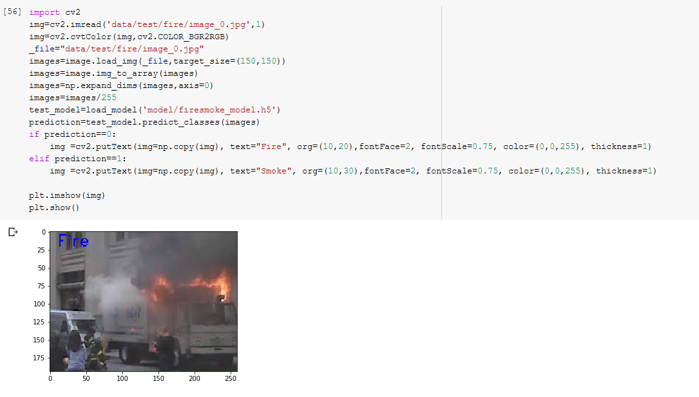
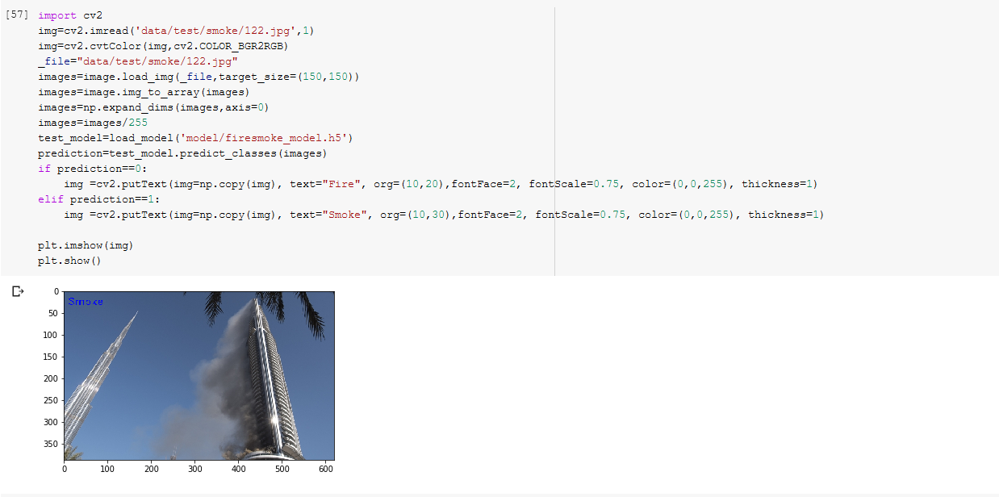

# FireDetection #

----------
**FireDetection is an artificial intelligence project for real-time fire detection and custom images.**

This is the first release of the FireDetection. It contains  dataset of 42 test images for training 100 images.

----------
To use your fire dataset in Tensorflow Object Detection API, you must convert it into the TFRecord file format. 
Dataset into a images document.

## Label Maps ##

Each dataset is required to have a label map associated with it. This label map defines a mapping from string class names to integer class Ids. The label map should be a StringIntLabelMap text protobuf. Sample label maps can be found in object_detection/training/labelmap. Label maps should always start from id 1.

## Training ##

**If you want train this model** :

    python train.py --logtostderr --train_dir=training/ --pipeline_config_path=training/faster_rcnn_inception_v2_pets.config

    

**After convert model checkpoint to pb file** :

    python export_inference_graph.py --input_type image_tensor --pipeline_config_path training/faster_rcnn_inception_v2_pets.config --trained_checkpoint_prefix training/model.ckpt-6516 --output_directory inference_graph
    

----------

----------
## Installation ##

    pip install requirements.txt 

> 
- If you have an Nvidia GPU, then you can install `tensorflow-gpu` package. It will make things run a lot faster.
Depending on the hardware configuration of your system, the execution time will vary. On CPU, training will be slow.If you want realtime fire detection model effect? Please use only tensorflow_gpu  GPU .

- Minimal:
- 16gb RAM
- Core i7
- Nvidia
 

----------

    python Object_detection_image.py

# Test #

----------

----------

# Keras #

**collect data from Google: Fire and Smoke**

Train Data : Train data contains the 200 images of each fire,smoke  total their are 400 images in the training dataset
Test Data : Test data contains 50 images of each fire and smoke  total their are 100 images in the test dataset

Below is the complete implementation:

     loss = 0.018

----------
## Test ##

----------

     > cd Keras_model
     > Directory of G:\FireDetection\object_detection\Keras_model
     > jupyter notebook firedetection.ipynb
     

----------

## Help
If you are facing any difficulty, feel free to create a new [issue](https://github.com/RashadGarayev/genderDetectionKeras/issues) or reach out on Facebook [Rashad Garayev](https://www.facebook.com/fly.trion) .
